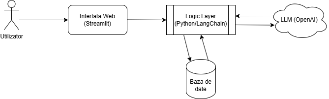

Demo: https://youtu.be/1jV4-09x2VQ

# Natural Language to SQL

**Author:** Chiose Mihnea-Stefan  
**Course:** Baze de Date de la NoSQL la Vector DB's  

---

## 1. Project Overview
This project implements a **Text-to-SQL system** that allows non-technical users to query a relational database using natural language. This system features a **Self-Repair Mechanism** to automatically fix SQL syntax errors and a **Feedback Section** to correct logical errors or misunderstandings in real-time.

### Key Features
* **Natural Language Processing:** Converts questions (e.g., "Show me expensive products") into SQL.
* **Self-Repair SQL:** Automatically detects database errors (e.g., `no such column`) and uses the LLM to repair the query without crashing.
* **Feedback Loop:** Allows the user to reject a result and provide a reason (e.g., "Sort by price, not date"), which the system uses to regenerate the query.

---

## 2. System Architecture

The system follows a modular architecture integrating a Streamlit frontend with a LangChain processing backend.

### 2.1 High-Level Architecture Diagram


### 2.2 Workflow Description
1.  **Input:** User asks a question via Streamlit.
2.  **Generation:** GPT-3.5 generates the initial SQL query based on the schema.
3.  **Execution & Validation:**
    * The system attempts to execute the query.
    * **If Error:** The `correction_prompt` is triggered (Self-Repair loop).
    * **If Success:** The result is displayed.
4.  **Feedback:**
    * If the user offers feedback, the `feedback_prompt` re-generates the query using the user's explanation.

---

## 3. Data Model

The system operates on a SQLite database (`test_db.sqlite`). Below is the Entity-Relationship (ER) schema used for testing.

| Table Name | Description | Key Columns |
| :--- | :--- | :--- |
| **Users** | Registered customers | `id` (PK), `name`, `email`, `signup_date` |
| **Products** | Inventory items | `id` (PK), `product_name`, `price`, `stock` |
| **Orders** | Transaction headers | `id` (PK), `user_id` (FK), `order_date`, `total_amount` |


---

## 4. Software & Configuration

### 4.1 Technology Stack
* **Language:** Python 3.10+
* **LLM Orchestration:** LangChain
* **Model:** OpenAI `gpt-3.5-turbo`
* **Database:** SQLite
* **Frontend:** Streamlit

### 4.2 Prerequisites & Installation
1.  Clone the repository.
2.  Install dependencies:
    ```bash
    pip install -r requirements.txt
    ```
3.  Configure environment variables in `.env`:
    ```
    OPENAI_API_KEY=sk-proj-...
    ```

### 4.3 Running the Tool
To start the web interface:
```bash
streamlit run app.py

---

## 5. Code Snippets

### 5.1 Self-Repair Mechanism (Auto-Correction)
The system does not crash on SQL errors. Instead, it captures the database exception and feeds it back to the LLM to generate a corrected query.

for attempt in range(MAX_RETRIES):
    result, error = run_query_safe(current_sql)
    
    if error is None:
        return final_answer, current_sql
    else:
        # Error detected: Trigger Correction Prompt
        chain_fix = correction_prompt | llm | StrOutputParser()
        current_sql = clean_sql(chain_fix.invoke({
            "original_query": current_sql,
            "error_message": error,
            "schema": schema_text
        }))

### 5.2 Feedback Prompt
This prompt enables the system to improve through user corrections within the session.

feedback_system = """You are an SQL assistant refining a query based on user feedback.
Original Question: {question}
Previous SQL (Rejected): {original_query}
User Feedback (Why it was wrong): {feedback}
Schema: {schema}
INSTRUCTIONS: Adjust the SQL query to satisfy the user's feedback."""

---

## 6. Bibliographic References
1. **LangChain Documentation** (2024) SQL Database Chains. Retrieved from https://python.langchain.com/docs/use_cases/sql/
2. **OpenAI API Reference** (2024) Chat Completions API. Retrieved from https://platform.openai.com/docs/guides/chat
3. **Streamlit Docs** (2024) Build conversational apps. Retrieved from https://docs.streamlit.io/
